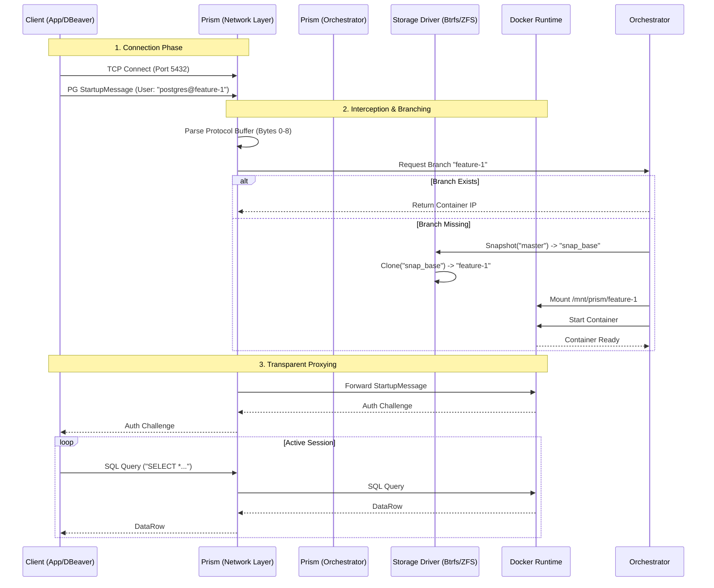
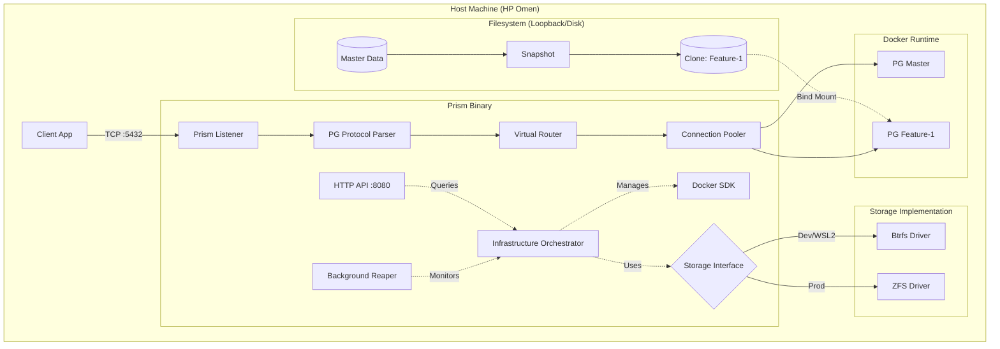

# Product Requirements Document: Prism (v0.1.0)

## Meta Data

| Field | Value |
| :--- | :--- |
| **Project** | **Prism** (formerly Ephemeral DB Proxy) |
| **Version** | **v0.1.0-alpha** (The "Foundation" Release) |
| **Owner** | Aditya Mishra (`@bit2swaz`) |
| **Status** | **COMPLETED / GOLD MASTER** |
| **Type** | Infrastructure-as-Code / Database Middleware |
| **Core Stack** | Go (TCP/Net), Postgres Wire Protocol, Docker SDK, Btrfs (Dev), ZFS (Prod) |

-----

## 1\. Executive Summary

### 1.1 The Vision

To democratize "Database Branching." Current solutions (Neon, PlanetScale) lock users into specific cloud vendors. **Prism** is the open-source middleware that brings **serverless, instant-branching capabilities** to *any* self-hosted PostgreSQL instance.

### 1.2 Core Value Proposition

  * **Speed:** Branch a 1TB database in \< 500ms using Copy-on-Write (CoW).
  * **Privacy:** Data never leaves your VPC (unlike SaaS alternatives).
  * **Cost:** "Scale-to-Zero" architecture. Unused branches consume $0 compute (RAM/CPU).

### 1.3 The "Resume" Objective

Demonstrate mastery of:

1.  **Systems Programming:** Custom TCP/Packet Parsing and OS-level File Descriptor management.
2.  **Storage Engines:** Abstracting filesystem primitives (ZFS vs Btrfs) behind a unified Go interface.
3.  **Concurrency:** Multiplexing thousands of dormant client connections to dynamic backends.

-----

## 2\. System Architecture

Prism operates on two planes: the **Data Plane** (Hot Path) which shuffles packets, and the **Control Plane** (Cold Path) which manages infrastructure.

### 2.1 High-Level Data Flow

[Image of prism architecture data flow diagram]



### 2.2 Component Diagram (Polymorphic Architecture)



-----

## 3\. Detailed Functional Requirements

### 3.1 The Wire Protocol Parser (The "Magic")

  * **Requirement:** Prism must implement a partial PostgreSQL frontend *and* backend.
  * **Mechanism:**
    1.  **Peek:** Read the first 8 bytes of the incoming TCP stream.
    2.  **Length Check:** Bytes 0-3 (Int32 Big Endian) determine packet size.
    3.  **Protocol Version:** Bytes 4-7 (Int32 Big Endian).
          * If `80877103` (SSLRequest): Reply `N` byte immediately. **Constraint:** v0.1.0 strictly enforces `sslmode=disable`.
          * If `00030000` (StartupMessage): Parse the Key-Value pairs.
    4.  **Extraction:** Extract `user` string. Split by `@`.
          * `postgres` -\> Route to Master.
          * `postgres@ticket-123` -\> Route to Branch `ticket-123`.

### 3.2 The Polymorphic Storage Engine

To solve the WSL2 vs Production dilemma, Prism uses a Driver Pattern.

#### 3.2.1 The Interface (`internal/storage/driver.go`)

```go
type Driver interface {
    // Init ensures filesystem is mounted and ready
    Init() error 
    // CreateSnapshot freezes the source and returns a generic snapshot ID
    CreateSnapshot(source string) (string, error)
    // Clone creates a writable directory from a snapshot
    Clone(snapshotID string, newBranchID string) (mountPath string, error)
    // Destroy cleans up the branch
    Destroy(id string) error
}
```

#### 3.2.2 The Btrfs Driver (WSL2 / Dev)

  * **Strategy:** Uses `btrfs subvolume snapshot`.
  * **Why:** Native to Linux kernel, supported in WSL2 (unlike ZFS which requires custom kernels).
  * **Implementation:** Executes `exec.Command("btrfs", "subvolume", "snapshot", src, dst)`.
  * **Mounting:** Returns the path `/mnt/prism_data/branches/<id>` which Docker binds.

### 3.3 Connection Holding (The UX Polish)

  * **Problem:** Docker takes \~500ms to start. Clients timeout.
  * **Solution:** **TCP Flow Control.**
      * When a branch is missing, Prism pauses reading from the *client socket*.
      * It initiates the orchestrator.
      * Once the backend is healthy, it manually constructs and sends the `StartupMessage` to the backend (since the bytes were consumed during parsing).
      * **Result:** The user sees a slight "lag" on the first connection, but no error.

### 3.4 The "Reaper" (Garbage Collection)

  * **Requirement:** Prevent 16GB RAM exhaustion.
  * **Logic:**
      * **Structure:** `map[string]time.Time` tracks `LastActive` timestamps.
      * **Loop:** Background ticker (10s for dev, 15m for prod).
      * **Pause:** If `now - LastActive > Threshold`, call `docker stop <container>`.
      * **Result:** Data is preserved on disk, but RAM is freed.

-----

## 4\. Hardware Adaptation Strategy (HP Omen + WSL2)

Your hardware is powerful but memory-constrained. The architecture is tuned specifically for this "Omen Config."

| Resource | Constraint | Optimization Strategy |
| :--- | :--- | :--- |
| **RAM** | 16 GB Total | **1. System Clamp:** `.wslconfig` limits VM to 6GB.<br>**2. Reaper:** Aggressively stops idle containers.<br>**3. Driver Clamp:** Btrfs uses OS page cache (shared with Windows), unlike ZFS ARC. This is safer for WSL2. |
| **Storage** | 1TB NVMe | **Loopback Isolation:** We create a 20GB file (`disk.img`) and format it as Btrfs. This prevents Prism from flooding your main Windows drive with small files. |
| **Networking**| WSL2 Bridge | **Port Mapping Hack:** We map container port 5432 to a random Host Port (`127.0.0.1:0`) to bypass WSL2's internal routing restrictions. |

-----

## 5\. Development Roadmap Status

### Phase 1: The "Btrfs Lab" (Foundation)

  * **Goal:** Prove filesystem physics.
  * **Status:** ✅ **DONE**
  * **Deliverable:** Validated Btrfs loopback mount capable of snapshots in \< 25ms.

### Phase 2: The "Socket Plumber" (Network)

  * **Goal:** Connect Client -\> Prism -\> Docker.
  * **Status:** ✅ **DONE**
  * **Deliverable:** Go binary listening on 5432 that parses `postgres@branch`.

### Phase 3: The "Orchestrator" (Core Logic)

  * **Goal:** Dynamic Creation.
  * **Status:** ✅ **DONE**
  * **Deliverable:** Integration of `btrfs snapshot` -\> `docker run` -\> `net.Dial`.

### Phase 4: The "Control Plane" (Management)

  * **Goal:** Operational Maturity.
  * **Status:** ✅ **DONE**
  * **Deliverable:**
      * Background Reaper (Auto-Kill).
      * HTTP API (`GET /branches`) on port 8080.

-----

## 6\. Deployment Guide (Quickstart)

### Prerequisites

  * **OS:** Linux or WSL2 (Ubuntu 22.04+).
  * **Dependencies:** `docker`, `btrfs-progs`, `go 1.21+`.
  * **Root Access:** Required for `mount` and `btrfs` commands.

### Setup

1.  **Initialize Storage:**

    ```bash
    # Create 10GB Virtual Disk
    dd if=/dev/zero of=disk.img bs=1G count=10
    mkfs.btrfs disk.img
    mount -o loop disk.img /mnt/prism_data

    # Create Gold Master
    btrfs subvolume create /mnt/prism_data/master
    # Populate master with initial DB data using a temp container...
    ```

2.  **Build & Run:**

    ```bash
    go build -o prism cmd/prism/main.go
    sudo ./prism
    ```

3.  **Connect:**

    ```bash
    psql "host=localhost port=5432 user=postgres@new-feature password=password sslmode=disable"
    ```

4.  **Manage:**

    ```bash
    curl http://localhost:8080/branches
    ```