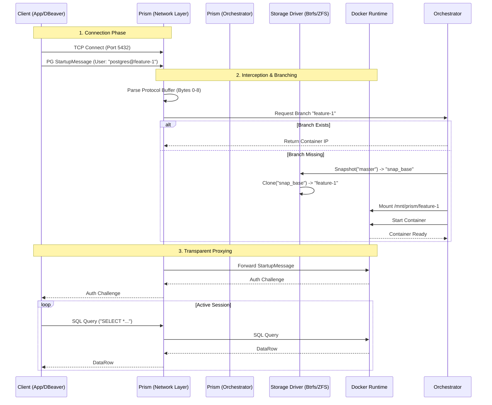
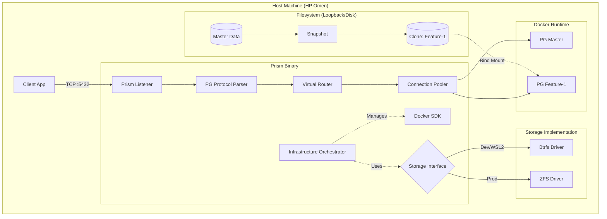

# Product Requirements Document: Prism (v0.1.0)

## Meta Data

| Field | Value |
| :--- | :--- |
| **Project** | **Prism** (formerly Ephemeral DB Proxy) |
| **Version** | v0.1.0-alpha (The "Foundation" Release) |
| **Owner** | Aditya Mishra (`@bit2swaz`) |
| **Status** | **APPROVED FOR IMPLEMENTATION** |
| **Type** | Infrastructure-as-Code / Database Middleware |
| **Core Stack** | Go (TCP/Net), Postgres Wire Protocol, Docker SDK, Btrfs (Dev), ZFS (Prod) |

-----

## 1\. Executive Summary

### 1.1 The Problem

In modern CI/CD, the database is the bottleneck. While code is branched via Git and builds are cached via VelocityCache, the database remains a monolithic, shared resource ("Staging DB").

  * **Collision:** Developer A runs a migration that breaks Developer B's code.
  * **Latency:** Recreating a DB for tests takes minutes (dump/restore).
  * **Vendor Lock-in:** Solutions like Neon or PlanetScale offer branching but require migrating data to their cloud.

### 1.2 The Solution: Prism

Prism is a **self-hosted, protocol-aware reverse proxy** for PostgreSQL. It sits between your application and your database storage. By intercepting the PostgreSQL Wire Protocol, Prism detects branch contexts (e.g., via `postgres@feature-1`) and uses a **Polymorphic Storage Engine** to spin up an isolated, read-write clone of the production database in milliseconds using filesystem-level Copy-on-Write (CoW).

### 1.3 The "Resume" Objective

To demonstrate mastery of:

1.  **Systems Programming:** Custom TCP/Packet Parsing and OS-level File Descriptor management.
2.  **Storage Engines:** Abstracting filesystem primitives (ZFS vs Btrfs) behind a unified Go interface.
3.  **Concurrency:** Multiplexing thousands of dormant client connections to dynamic backends.

-----

## 2\. System Architecture

Prism operates on two planes: the **Data Plane** (Hot Path) which shuffles packets, and the **Control Plane** (Cold Path) which manages infrastructure.

### 2.1 High-Level Data Flow



### 2.2 Component Diagram (Polymorphic Architecture)



-----

## 3\. Detailed Functional Requirements

### 3.1 The Wire Protocol Parser (The "Magic")

  * **Requirement:** Prism must implement a partial PostgreSQL frontend *and* backend.
  * **Mechanism:**
    1.  **Peek:** Read the first 8 bytes of the incoming TCP stream.
    2.  **Length Check:** Bytes 0-3 (Int32) determine packet size.
    3.  **Protocol Version:** Bytes 4-7.
          * If `80877103` (SSLRequest): Reply `N` byte immediately. **Constraint:** v0.1.0 strictly enforces `sslmode=disable`.
          * If `00030000` (StartupMessage): Parse the Key-Value pairs.
    4.  **Extraction:** Extract `user` string. Split by `@`.
          * `postgres` -\> Route to Master.
          * `postgres@ticket-123` -\> Route to Branch `ticket-123`.

### 3.2 The Polymorphic Storage Engine

To solve the WSL2 vs Production dilemma, Prism uses a Driver Pattern.

#### 3.2.1 The Interface (`internal/storage/driver.go`)

```go
type Driver interface {
    // Init ensures filesystem is mounted and ready
    Init() error 
    // CreateSnapshot freezes the source and returns a generic snapshot ID
    CreateSnapshot(source string) (string, error)
    // Clone creates a writable directory from a snapshot
    Clone(snapshotID string, newBranchID string) (mountPath string, error)
    // Destroy cleans up the branch
    Destroy(id string) error
}
```

#### 3.2.2 The Btrfs Driver (WSL2 / Dev)

  * **Strategy:** Uses `btrfs subvolume snapshot`.
  * **Why:** Native to Linux kernel, supported in WSL2 (unlike ZFS which requires custom kernels).
  * **Implementation:** Executes `exec.Command("btrfs", "subvolume", "snapshot", src, dst)`.
  * **Mounting:** Returns the path `/mnt/prism_data/branches/<id>` which Docker binds.

#### 3.2.3 The ZFS Driver (Production)

  * **Strategy:** Uses `zfs snapshot` and `zfs clone`.
  * **Why:** True enterprise-grade data integrity, compression, and ARC caching.
  * **Implementation:** Executes `zfs clone pool/snaps/<id> pool/branches/<id>`.

### 3.3 Connection Holding (The UX Polish)

  * **Problem:** Docker takes \~500ms to start. Clients timeout.
  * **Solution:** **TCP Flow Control.**
      * When a branch is missing, Prism pauses reading from the *client socket*.
      * It initiates the orchestrator.
      * It periodically sends TCP Keep-Alives.
      * Once the backend is healthy, it flushes the buffered StartupMessage to the new backend.
      * **Result:** The user sees a slight "lag" on the first connection, but no error.

### 3.4 The "Reaper" (Garbage Collection)

  * **Requirement:** Prevent 16GB RAM exhaustion.
  * **Logic:**
      * Background ticker (1 min).
      * **Pause:** If `active_connections == 0` for \> 15 mins, `docker stop <container>`. (Data preserved).
      * **Purge:** If stopped for \> 24 hours, `btrfs subvolume delete <path>`. (Data destroyed).

-----

## 4\. Hardware Adaptation Strategy (HP Omen + WSL2)

Your hardware is powerful but memory-constrained. The architecture is tuned specifically for this "Omen Config."

| Resource | Constraint | Optimization Strategy |
| :--- | :--- | :--- |
| **RAM** | 16 GB Total | **1. System Clamp:** `.wslconfig` limits VM to 6GB.<br>**2. DB Clamp:** Inject `postgresql.conf` with `shared_buffers=128MB`.<br>**3. Driver Clamp:** Btrfs uses OS page cache (shared with Windows), unlike ZFS ARC. This is safer for WSL2. |
| **Storage** | 1TB NVMe | **Loopback Isolation:** We create a 20GB file (`disk.img`) and format it as Btrfs. This prevents Prism from flooding your main Windows drive with small files. |
| **CPU** | Ryzen 7 (8c/16t) | Go routines will utilize all cores. We can handle high concurrency easily. |

-----

## 5\. Roadmap & Phasing

### Phase 1: The "Btrfs Lab" (Day 1-2)

  * **Objective:** Prove filesystem physics.
  * **Deliverable:** A Btrfs loopback file mounted in WSL2 that can snapshot a 1GB folder in \< 50ms.
  * **Verification:** Run the `time` command on a manual snapshot.

### Phase 2: The "Socket Plumber" (Day 3-4)

  * **Objective:** Connect Client -\> Prism -\> Docker.
  * **Deliverable:** A Go binary that listens on 5432, parses the user, and blindly proxies traffic to a pre-existing container.
  * **Verification:** Connect `psql` to Prism and run `SELECT 1`.

### Phase 3: The "Orchestrator" (Day 5-7)

  * **Objective:** Dynamic Creation.
  * **Deliverable:** Integration of the Storage Driver. When a user connects to `non_existent_branch`, Prism calls `btrfs snapshot` -\> `docker run`.
  * **Verification:** Connect to `postgres@new-feature` and see a new container spin up automatically.

----

*Working on it ^^*