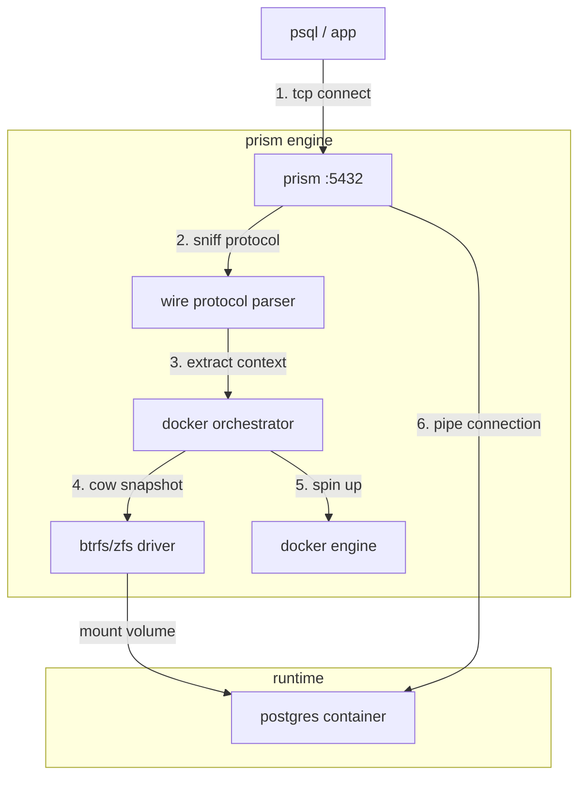

# Prism

**serverless, instant database branching for any postgresql.**

[](https://goreportcard.com/report/github.com/bit2swaz/prism)
[](https://opensource.org/licenses/MIT)
[](https://www.google.com/search?q=)

**prism** is a protocol-aware reverse proxy that brings "neon/planetscale-like" branching capabilities to self-hosted postgresql. it sits between your application and your database, intercepting tcp traffic to provision isolated, read-write copies of your production database in **milliseconds**.

> **demo:** connect to a branch that doesn't exist, and prism spins it up instantly.
> `psql "postgres://postgres@new-feature:password@localhost:5432/postgres"`

-----

## Why Prism?

in modern ci/cd, the database is the bottleneck. code is branched, but the database is a monolith.

  * **the problem:** running migrations in staging breaks other developers. restoring a db for a pr takes minutes.
  * **the solution:** prism uses **copy-on-write (cow)** filesystem snapshots (zfs/btrfs) to clone terabyte-scale databases in o(1) time (\~300ms).

### Key Features

  * **just-in-time provisioning:** intercepts the postgres wire protocol to detect the requested branch. if it's missing, prism builds it instantly.
  * **\< 500ms cold starts:** uses kernel-level snapshots instead of slow sql dumps.
  * **scale-to-zero:** integrated "reaper" kills idle containers after 15 minutes to save ram, but persists data on disk.
  * **protocol agnostic:** works with `psql`, `dbeaver`, `pgadmin`, `typeorm`, `prisma`, etc. no client-side changes needed.
  * **privacy first:** 100% self-hosted. your data never leaves your vpc.

-----

## Architecture

prism is a **layer-4/layer-7 hybrid proxy** written in go.



1.  **the ear:** listens on port `5432`.
2.  **the brain:** peeks at the first 8 bytes of the tcp stream to decode the `startupmessage` and extract the target branch (e.g., `user@feature-1`).
3.  **the hand:** if the branch doesn't exist, it calls the storage driver to snapshot the master db and the docker engine to mount it.
4.  **the pipe:** once the container is ready (\~400ms), prism splices the tcp connection. the client never knows the db wasn't there.

-----

## Getting Started (Local / WSL2)

prism is optimized for **linux** environments (production) and **wsl2** (development) using the btrfs driver.

### Prerequisites

  * go 1.21+
  * docker engine (native)
  * `btrfs-progs` installed (`sudo apt install btrfs-progs`)

### 1\. Setup Storage (The "Virtual Lab")

we create a virtual disk to safely use btrfs without partitioning your drive.

```bash
# 1. create a 10gb virtual disk
dd if=/dev/zero of=disk.img bs=1G count=10

# 2. format & mount
mkfs.btrfs disk.img
sudo mkdir -p /mnt/prism_data
sudo mount -o loop disk.img /mnt/prism_data

# 3. create the gold master
cd /mnt/prism_data
sudo btrfs subvolume create master

# 4. populate master (run once to init db)
sudo docker run --rm -v /mnt/prism_data/master:/var/lib/postgresql/data -e POSTGRES_PASSWORD=password postgres:15-alpine
```

### 2\. Run Prism

```bash
# build the binary
go build -o prism cmd/prism/main.go

# run with sudo (required for btrfs commands)
sudo ./prism
```

### 3\. Experience Magic

open a new terminal. connect to a branch that **does not exist**.

```bash
# syntax: user=<db_user>@<branch_name>
psql "host=localhost port=5432 user=postgres@amazing-feature password=password sslmode=disable"
```

you will see a slight pause (approx 400ms), and then... **connected**.

-----

## Control Plane

prism exposes a lightweight management api on port `8080`.

| Method | Endpoint | Description |
| :--- | :--- | :--- |
| `GET` | `/branches` | list all active branches and their last activity time. |

```bash
$ curl http://localhost:8080/branches
{"amazing-feature": "2025-12-02T22:01:43Z"}
```

-----

## Technical Deep Dive

### The "Hold" Logic

docker takes \~500ms to start. standard clients would timeout or get "connection refused." prism implements a **tcp flow control** mechanism:

1.  accepts the tcp handshake immediately.
2.  reads the startup packet.
3.  **pauses** reading from the socket (blocking the client).
4.  provisions infrastructure.
5.  replays the startup packet to the backend and unblocks the pipe.

### The Reaper (Scale-to-Zero)

to prevent ram exhaustion, prism tracks connection activity.

  * **idle threshold:** default 15 minutes.
  * **action:** `docker stop` (data is preserved on disk).
  * **wake-up:** next connection automatically restarts the container.

-----

## License

mit license

-----

*made with ❤️ by [@bit2swaz](https://x.com/bit2swaz).*